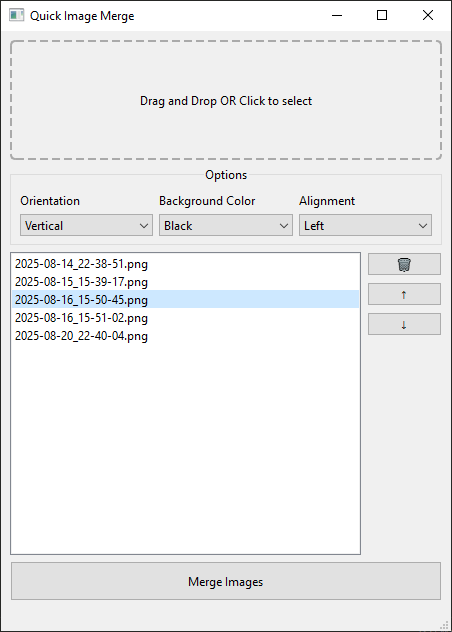

# Quick Image Merge

A lightweight Windows application built with C++ and Qt for merging multiple images into a single image.

    

## Features

- Vertical & Horizontal Stitching for multiple images.
- Changing the order of the images.
- Customizable background color (white, black, or transparent).
- Customizable alignment (left, center, or right for vertical, top, center, or bottom for horizontal).

## Roadmap / Future Plans

- [ ] Custom color for background.
- [ ] Button for Windows context menu.
- [ ] Image thumbnails.
- [ ] Merge into grid.

## Download
You can download compiled executables for Windows from the [releases page](https://github.com/leomartinezdev/quick-image-merge/releases).

### System Requirements

The program is a **64-bit application for Windows**. It will not run on 32-bit systems.
Works on Windows 11, and Windows 10. Launching on Windows 8.1, Windows 8, and Windows 7 requires a Universal C Runtime (UCRT) to be installed.

## License
This project is licensed under the MIT License. See the [LICENSE](LICENSE) file for details.
